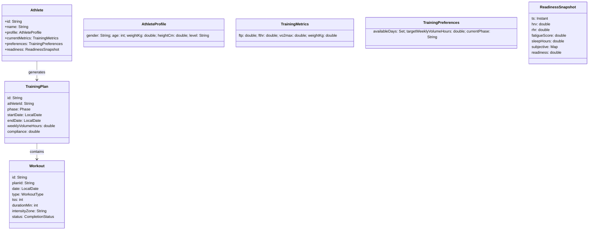
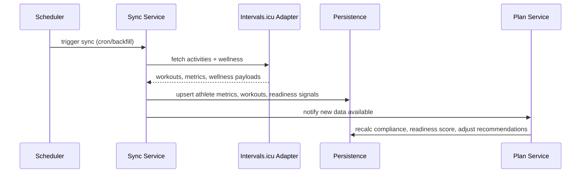

# Training Coach Architecture

AI-powered cycling coaching platform for generating training plans, assessing readiness/wellness, and tracking athlete progress. Initial integration targets Intervals.icu; design anticipates TrainingPeaks/Strava later.

## Goals
- Generate polarized (Seiler 80/20) training plans constrained by athlete availability, volume, and current phase.
- Continuously sync athlete data (workouts, wellness) from Intervals.icu; support more platforms via pluggable adapters.
- Provide readiness/compliance scoring and coach-facing insights.
- Keep AI as an assistant (explanations, suggestions) while deterministic domain logic governs constraints and safety.

## High-Level Architecture
```mermaid
flowchart LR
    subgraph Interface
        API[REST API]
        Docs[OpenAPI]
    end

    subgraph Application
        AthSvc[Athlete Service]
        PlanSvc[Plan Service]
        SyncSvc[Sync Orchestrator]
        AiSvc[AI Coaching Service]
    end

    subgraph Domain
        AthDom[Athlete Domain]
        PlanDom[Plan/Workout Domain]
        Readiness[Readiness & Load]
    end

    subgraph Infrastructure
        Intervals[Intervals.icu Adapter]
        TP[TrainingPeaks Adapter (future)]
        Strava[Strava Adapter (future)]
        Repo[Persistence (JPA)]
        Events[Event Log]
    end

    API --> AthSvc
    API --> PlanSvc
    API --> SyncSvc
    API --> AiSvc

    AthSvc --> AthDom
    PlanSvc --> PlanDom
    PlanSvc --> Readiness
    SyncSvc --> AthDom
    SyncSvc --> Readiness

    AthSvc --> Repo
    PlanSvc --> Repo
    SyncSvc --> Repo

    SyncSvc --> Intervals
    SyncSvc -.-> TP
    SyncSvc -.-> Strava

    AiSvc --> PlanDom
    AiSvc --> Readiness
    AiSvc -.-> Claude[Claude/OpenAI]

    Repo --> Events
```

## Bounded Contexts
- **Athlete**: profile, metrics (FTP/FTHR/VO2), preferences (availability, weekly hours, phase), readiness signals.
- **Training Plan**: plan generator (phase-aware, 80/20), workouts, progress/compliance tracking.
- **Sync**: platform adapters (Intervals.icu first), schedulers, ingestion/webhook handling, event log.
- **Analysis/Readiness**: load trends (CTL/ATL proxy), recovery flags, readiness score, intensity distribution.
- **AI Assist**: narrative explanations, plan adjustments proposals; domain remains source of truth.

## Domain Model (initial)


## Key Ports (Hexagonal)
- **FitnessPlatformPort**: fetch activities, wellness, metrics; push planned workouts (where supported). First adapter: Intervals.icu REST client.
- **PlanGenerationPort**: encapsulate deterministic plan builder; allows swapping algorithm versions.
- **AIAdvicePort**: bridge to Claude/OpenAI for explanations and optional adjustments.
- **EventLogPort**: append immutable sync and plan events for audit/replay.

## Application Services (examples)
- **AthleteService**: manage athlete lifecycle, update metrics/preferences, compute readiness snapshot from latest signals.
- **SyncService**: scheduled/backfill sync; webhook ingestion; dedupe and persist events; raise domain events for downstream processing.
- **PlanService**: generate/update plans per athlete and phase; evaluate compliance (planned vs completed); expose weekly summaries.
- **AIService**: generate explanations for coaches/athletes; propose plan tweaks within safety constraints.

## Data Flow (Intervals.icu-first)


## Readiness & Compliance (initial rules)
- Combine objective (HRV, RHR, load trend, sleep) and subjective (RPE, soreness) into a readiness score 0-100.
- Flag safeguards: cap daily intensity if fatigue high; adjust weekly volume if readiness stays low.
- Compliance: planned vs completed duration/intensity; track streaks and missed sessions.

## AI Usage Principles
- AI outputs are advisory; deterministic rules enforce safety (volume/intensity bounds, rest days).
- Prompts include constraints, recent metrics, phase, and availability; redact PII.
- Keep adapters swappable (Claude/OpenAI) via `AIAdvicePort` with feature flagging.

## Backlog Seeds (Phase 1)
- Implement `FitnessPlatformPort` + Intervals.icu adapter (activities, wellness, metrics).
- Add domain models for readiness, training plan, workout; repositories + mappers.
- Expose REST endpoints: CRUD athlete, trigger sync, get readiness, generate weekly plan, list workouts.
- Wire scheduler + event log for sync runs.
- Add OpenAPI via springdoc; tighten build (Spotless, SpotBugs, JaCoCo thresholds).

## Future Extensions
- Additional platforms: TrainingPeaks, Strava, Garmin.
- Coach dashboards: compliance trends, readiness heatmaps, progression alerts.
- Plan variants: time-crunched mode, indoor/outdoor bias, race taper templates.
- Advanced modeling: ML-based load forecasting, individualized intensity distribution.
