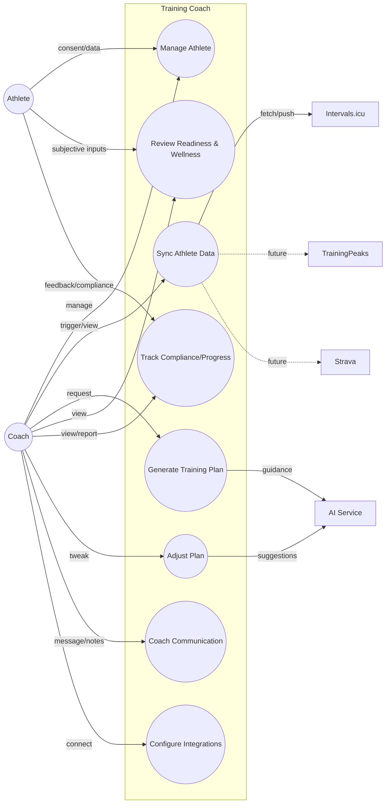

# Training Coach Use Cases (UML)

This document captures primary use cases for the Training Coach platform using UML use case diagrams (mermaid syntax) and concise textual flows. Actors include Coach (primary user), Athlete (data subject), and External Platforms (Intervals.icu first, future TrainingPeaks/Strava).

## Use Case Overview

## UC1: Manage Athlete
**Goal:** Create/update athlete profile, metrics, preferences, and platform links.
- Actors: Coach (primary), Athlete (consent), External Platforms (data source links).
- Main flow:
  1) Coach creates athlete with profile (age, level), metrics (FTP/FTHR/VO2), preferences (availability, volume, phase).
  2) Coach connects athlete to Intervals.icu (API key/token) and sets sync cadence.
  3) System validates and persists; returns athlete ID and link status.
- Alt flows:
  - Missing consent or invalid token -> error with remediation steps.
  - Metrics unknown -> system infers defaults or requests test protocol.

## UC2: Sync Athlete Data
**Goal:** Ingest workouts, metrics, and wellness from Intervals.icu (and future platforms) into unified model.
- Actors: Coach (triggers/backfill), Scheduler (cron), External Platform.
- Main flow:
  1) Scheduler or Coach triggers sync.
  2) System calls Intervals.icu adapter to fetch since last checkpoint.
  3) System upserts workouts, metrics, wellness, readiness signals; logs sync event.
  4) System notifies readiness/compliance evaluators.
- Alt flows:
  - API failure -> retry/backoff; surface error in sync log.
  - Duplicates -> dedupe via event IDs/checkpoints.

## UC3: Generate Training Plan
**Goal:** Produce a phase-aware polarized plan respecting availability and volume.
- Actors: Coach (request), AI (advisory), System (deterministic planner).
- Main flow:
  1) Coach requests plan (phase, duration, start date, target weekly hours).
  2) Planner computes weekly volume split (80/20), assigns workouts per availability and metrics.
  3) System stores plan and workouts; returns summary (volume, intensity distribution, key sessions).
  4) AI optionally provides narrative rationale.
- Alt flows:
  - Insufficient availability vs target volume -> propose adjusted volume.
  - Missing metrics -> use defaults or request tests.

## UC4: Review Readiness & Wellness
**Goal:** Provide readiness score and wellness view combining objective/subjective inputs.
- Actors: Coach (view), Athlete (subjective inputs), External Platform (objective data).
- Main flow:
  1) System ingests HRV/RHR/load/sleep from Intervals.icu; collects RPE/soreness from athlete.
  2) Readiness engine scores 0-100 with flags (fatigue high, sleep low).
  3) Coach views readiness dashboard and trend.
- Alt flows:
  - Missing data -> degrade gracefully with confidence flags.

## UC5: Track Compliance/Progress
**Goal:** Measure adherence to planned workouts and track progression.
- Actors: Coach (view/report), Athlete (executes), External Platform (actuals).
- Main flow:
  1) Actual workouts ingested; matched to planned by date/type/duration.
  2) Compliance computed (duration/intensity deltas, missed/completed).
  3) Progress metrics (load trend, volume trend, streaks) updated.
  4) Coach views weekly report and alerts.
- Alt flows:
  - No planned workout match -> classify as ad-hoc and adjust load.

## UC6: Adjust Plan
**Goal:** Safely adapt plan based on readiness/compliance.
- Actors: Coach (approves), AI (suggests), System (enforces constraints).
- Main flow:
  1) System detects low readiness/high fatigue or low compliance.
  2) AI suggests tweaks (swap sessions, reduce intensity/volume).
  3) Coach reviews and applies; system updates plan and notifies athlete.
- Alt flows:
  - Hard safety rules override AI suggestions if they exceed caps.

## UC7: Coach Communication
**Goal:** Share notes/messages tied to athlete and plan context.
- Actors: Coach (author), Athlete (reader, future reply).
- Main flow:
  1) Coach posts note/message linked to athlete/plan/workout.
  2) System stores and surfaces in context views.
- Alt flows:
  - Optional AI-generated explanation for athlete-facing clarity.

## UC8: Configure Integrations
**Goal:** Manage platform connections and webhooks.
- Actors: Coach/Admin, External Platforms.
- Main flow:
  1) Coach/Admin enters API credentials, sets scopes and sync schedule.
  2) System validates tokens, registers webhooks (if supported).
  3) System tracks status/health and alerts on failures.
- Alt flows:
  - Token expires -> prompt re-auth; pause sync.

## Use Case Grouping by Phase
- **Phase 1 (MVP)**: UC1, UC2, UC3 (basic), UC4 (basic readiness), UC5 (basic compliance), UC8 (Intervals.icu only).
- **Phase 2**: UC4 advanced (richer signals), UC5 advanced reporting, UC6 automated suggestions, UC7 notes.
- **Phase 3**: Multi-platform UC2/UC8, AI-rich UC3/UC6 narratives, coach dashboards.
