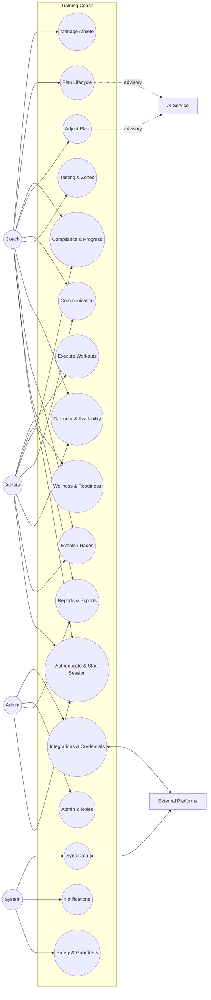

# Training Coach Use Cases (UML + Catalog)

This document captures core and extended use cases for the Training Coach platform (endurance training app) using high-level diagrams and concise textual flows. Detailed UML diagrams live in `docs/use-cases` as PlantUML blocks for each use case.

## Actors

- **Athlete**: executes training, logs wellness/feedback, consumes plans and insights.
- **Coach**: configures the athlete, plans training, reviews readiness/compliance, communicates.
- **Admin**: manages users/roles and platform integrations; operational oversight.
- **System**: schedulers, sync workers, notifications, data quality checks.
- **External Platforms**: Intervals.icu (current), future TrainingPeaks/Strava/Garmin, etc.
- **AI Service**: advisory assistant (explanations, draft suggestions) under deterministic safety rules.

## Acceptance Coverage (Current)

The Cucumber features in `src/test/resources/features/*.feature` currently cover only a subset (UC1/2/3/4/5/6/7/8/9 below), and some are implemented as calculators rather than full workflows.

## Use Case Overview (High-Level)

This diagram is intentionally high-level to stay readable.

## Use Case Catalog

IDs are stable; names can evolve. "Now" indicates what we should support early in product lifecycle.

| ID | Name | Primary Actor | Now | Notes |
|----|------|---------------|-----|------|
| UC1 | Manage Athlete | Coach | Yes | Profile, preferences, baseline metrics, consent |
| UC2 | Sync Athlete Data | System | Yes | Scheduled + manual backfill; dedupe/reconcile |
| UC3 | Plan Lifecycle | Coach | Yes | Generate, review, publish, revise, archive |
| UC4 | Execute Workouts | Athlete | Yes | Complete planned sessions; log RPE/notes |
| UC5 | Wellness & Readiness | Athlete | Yes | Subjective + objective, confidence/coverage |
| UC6 | Compliance & Progress | Coach | Yes | Match planned vs completed; weekly review |
| UC7 | Adjust Plan | Coach | Yes | Safety-first modifications; approvals |
| UC8 | Communication | Coach | Yes | Notes/messages linked to context |
| UC9 | Configure Integrations | Admin | Yes | Connect platforms, validate tokens, health |
| UC10 | Testing & Zones | Coach/Athlete | Soon | FTP/FTHR tests, zones, updates over time |
| UC11 | Calendar & Availability | Athlete | Soon | Availability changes, time off, travel |
| UC12 | Events / Races | Coach/Athlete | Soon | Goals, priority events, taper strategy |
| UC13 | Notifications | System | Soon | Reminders, missed workouts, fatigue alerts |
| UC14 | Reports & Exports | Coach/Admin | Soon | Weekly summaries, PDF/CSV export, audit |
| UC15 | Admin & Roles | Admin | Yes | Users, roles, permissions (real auth later) |
| UC16 | Safety & Guardrails | System | Yes | Caps, injury/fatigue safeguards, AI constraints |
| UC0 | Authenticate & Start Session | Athlete/Coach (Admin in dev only) | Yes | Username + password; session context for TUI |
| UC21 | Register User | Unauthenticated User | Yes | Create Athlete/Coach user from Login (username-only) |
| UC22 | Reset Password | Unauthenticated User | Yes | Self-service reset code shown in TUI (no email/SMS) |
| UC23 | Dev-mode Seed Users | System | Yes (Dev only) | Seeds `admin/admin`, `test-athlete/test`, `test-coach/test` |
| UC17 | Workout Library | Coach | Later | Workout templates, reuse, sharing |
| UC18 | Multi-Platform Reconciliation | System | Later | Merge duplicates, source of truth rules |
| UC19 | Athlete Self-Service Settings | Athlete | Later | Preferences, units, privacy controls |
| UC20 | Data Retention & Consent | Admin | Later | Delete/export personal data, consent log |

## PlantUML Diagrams (Per Use Case)

Each use case now has its own Markdown document containing a PlantUML use case diagram, activity diagram, and workflow state diagram. See `docs/use-cases`.

## UC0: Authenticate & Start Session

**Goal:** Establish a session and load role-based access from a Login-first TUI.

- Actors: Athlete, Coach. (Admin may authenticate in dev mode only; see UC23.)
- Trigger:
  - Application starts with no active session.
- Main flow:
  1) System displays the Login screen as the initial TUI screen.
  2) User enters `username` + `password`.
  3) System validates credentials against persisted users/roles.
  4) Session initializes UI context (role, selected athlete scope).
- Alt flows:
  - Invalid credentials -> deny access; show error; apply per-session throttling.
  - Disabled user -> deny access with remediation guidance.
  - User selects "Create account" -> proceed to UC21.
  - User selects "Reset password" -> proceed to UC22.

## UC1: Manage Athlete

**Goal:** Create/update athlete profile, preferences, baseline metrics, and platform links.

- Actors: Coach (primary), Athlete (consent), Admin (optional), External Platforms (link).
- Main flow:
  1) Coach creates athlete profile (age, level), preferences (availability, weekly volume, phase), and baseline metrics (FTP/FTHR/VO2/weight).
  2) Coach assigns athlete to a coach/team (optional) and sets expectations (communication cadence).
  3) Coach links athlete to external platform (token/key) and chooses sync scope (activities, wellness, both).
  4) System validates, persists, returns athlete ID and link status.
- Alt flows:
  - Metrics unknown -> system requests a test protocol (UC10) or uses defaults with low-confidence flag.
  - Missing consent/token invalid -> show remediation steps; allow partial save without integration.

## UC2: Sync Athlete Data

**Goal:** Ingest workouts/activities, wellness, and metrics signals from platforms into unified model.

- Actors: System (scheduler), Coach/Admin (manual trigger), External Platforms.
- Main flow:
  1) System runs scheduled sync per athlete/platform; coach can trigger backfill.
  2) Adapter fetches by checkpoint (time window + remote ids).
  3) System dedupes, upserts, and records a sync run summary (counts, errors, latency).
  4) Downstream computations run (training load, readiness, compliance matching).
- Alt flows:
  - API rate limits -> retry/backoff; partial success with recorded error state.
  - Duplicates across platforms -> reconciliation rules (UC18).

## UC3: Plan Lifecycle

**Goal:** Create a plan, review it, publish it to the athlete, and revise safely over time.

- Actors: Coach (primary), Athlete (consumer), AI (advisory).
- Main flow:
  1) Coach chooses a planning horizon (e.g., 4–12 weeks), phase/goals, and target weekly volume.
  2) Planner produces a draft plan; coach reviews weekly structure and key sessions.
  3) Coach publishes the plan; athlete sees it in calendar form.
  4) Over time, coach revises plan based on readiness/compliance (UC6/UC7); plan versions are preserved.
- Alt flows:
  - Availability mismatch -> propose an adjusted weekly volume and/or fewer key workouts.
  - Event date change -> rebase the plan; keep a history of changes.

## UC4: Execute Workouts

**Goal:** Athlete completes planned workouts and provides minimal feedback needed for adaptation.

- Actors: Athlete (primary), External Platforms (actuals), Coach (observer).
- Main flow:
  1) Athlete views today’s planned workout (time, type, targets).
  2) Athlete completes workout; actuals are synced (UC2).
  3) Athlete optionally logs RPE, notes, perceived difficulty, pain flags.
  4) System matches workout to plan (UC6) and updates readiness/compliance context.
- Alt flows:
  - Workout skipped -> capture reason; propose recovery or swap options.
  - Ad-hoc workout -> classify and incorporate load; coach can “adopt” it into plan history.

## UC5: Wellness & Readiness

**Goal:** Combine subjective and objective signals into actionable readiness and risk flags.

- Actors: Athlete (inputs), Coach (review), System (compute), External Platforms (objective).
- Main flow:
  1) Athlete submits subjective wellness (fatigue, stress, sleep quality, motivation, soreness).
  2) System ingests objective signals (HRV/RHR/sleep/load).
  3) Readiness engine computes readiness score + confidence based on data coverage.
  4) Coach/athlete views dashboard and trends; system generates flags (fatigue high, sleep low, load high).
- Alt flows:
  - Missing data -> degrade gracefully, show confidence/coverage, avoid overconfident guidance.

## UC6: Compliance & Progress

**Goal:** Track adherence and progression for weekly review and long-term planning.

- Actors: Coach (primary), Athlete (secondary), System (compute).
- Main flow:
  1) System matches planned workouts to completed activities (date/time/type tolerance windows).
  2) Compliance computed across duration, intensity distribution, and key session completion.
  3) Progress metrics computed (load trend proxies, streaks, polarized split adherence).
  4) Z2 creep is flagged explicitly when moderate-intensity time exceeds thresholds.
  5) Coach reviews weekly summary and flags; athlete sees a simplified view.
- Alt flows:
  - No match -> classify as ad-hoc; coach can manually link/unlink.
  - Conflicting sources -> apply reconciliation rules and show provenance (UC18).

## UC7: Adjust Plan

**Goal:** Safely adapt the plan based on readiness, compliance, and events without breaking constraints.

- Actors: Coach (primary), AI (advisory), System (enforce).
- Main flow:
  1) System detects triggers (low readiness streak, missed key session, travel, event change).
  2) Coach requests adjustments; AI proposes options with rationale.
  3) System applies deterministic guardrails (caps on weekly load, minimum recovery).
  4) When reducing intensity, sprint work is removed before VO2-optimal work; Z2 is minimized.
  5) Coach approves and publishes updated plan; change history recorded.
- Alt flows:
  - AI suggestion violates safety -> reject; provide safe alternatives.

## UC8: Communication

**Goal:** Share notes/messages tied to athlete and plan context.

- Actors: Coach (author), Athlete (reader/replier later).
- Main flow:
  1) Coach posts note linked to athlete and optionally a date/workout.
  2) Athlete reads; coach can follow up; notifications may fire (UC13).
- Alt flows:
  - AI-generated explanation rewrite for athlete clarity (optional).

## UC9: Configure Integrations

**Goal:** Manage platform connections, scopes, and health.

- Actors: Admin (primary), Coach (limited), External Platforms.
- Main flow:
  1) Admin connects a platform (OAuth/token/key), sets scopes, and selects sync cadence.
  2) System validates credentials; tests a minimal API call.
  3) System exposes integration health (last success, errors, rate limits).
- Alt flows:
  - Token expired -> prompt re-auth; pause sync.

## UC10: Testing & Zones

**Goal:** Keep intensity anchors current (LT1/LT2 + FTP/FTHR) and use them for prescription, classification, and analysis.

- Actors: Coach/Athlete.
- Main flow:
  1) Coach schedules a test protocol (lab lactate/ventilatory, FTP ramp/20min, FTHR, VO2 estimate).
  2) Athlete performs test; results are synced or entered manually.
  3) System updates intensity anchors and derives:
     - Seiler 3-zone boundaries (Z1/Z2/Z3) anchored on LT1/LT2
     - Prescription target bands inside zones (e.g., FATMAX within Z1; VO2-optimal vs sprint within Z3)
  4) Each prescription band carries a method and confidence.
  5) System applies updated anchors to:
     - future workout prescriptions (targets)
     - session classification (time-in-zone)
     - compliance and progress reporting
  6) Historical integrity: completed workouts remain associated with the thresholds that were effective at the time.

**Notes:**
- Z1/Z2/Z3 is for distribution/classification; prescription often uses narrower bands (see `docs/SEILER_INTENSITY_MODEL.md`).

## UC11: Calendar & Availability

**Goal:** Respect real-life constraints and drive plan feasibility.

- Actors: Athlete (primary), Coach (secondary).
- Main flow:
  1) Athlete maintains availability template (days/time windows) and exceptions (travel, rest week).
  2) System uses availability during plan generation and adjustments (UC3/UC7).
  3) Coach reviews conflicts and resolves.

## UC12: Events / Races

**Goal:** Build training around goal events with taper and priority.

- Actors: Athlete/Coach.
- Main flow:
  1) Athlete enters events (date, discipline, priority, target).
  2) Plan generator uses event timeline to structure phases and taper.
  3) Coach reviews and publishes.

## UC13: Notifications

**Goal:** Help athletes stay on track and surface risk to coaches.

- Actors: System.
- Main flow:
  1) Reminders for planned workouts and wellness submissions.
  2) Alerts for missed key sessions, low readiness streaks, unusually high load.
  3) Coach digest reports and athlete nudges.

## UC14: Reports & Exports

**Goal:** Produce weekly summaries, audit trails, and data export.

- Actors: Coach/Admin.
- Main flow:
  1) Weekly athlete summary (compliance, load, readiness trend, key notes).
  2) Export data (CSV/JSON); generate shareable report snapshots.
  3) Audit trail for plan changes and sync runs.

## UC15: Admin & Roles

**Goal:** Control access and reduce accidental misuse.

- Actors: Admin.
- Main flow:
  1) Create users, assign roles (coach/athlete/admin), manage preferences/units.
  2) Configure organization/team structures (optional).
  3) Manage operational settings (rate limits, feature flags).

**Note (MVP constraint):** Admin is not allowed via the user-facing registration UI. Admin authentication is supported only in dev mode via seeded credentials (UC23).

## UC16: Safety & Guardrails

**Goal:** Prevent unsafe training prescriptions and constrain AI.

- Actors: System.
- Main flow:
  1) Enforce minimum rest, cap weekly load ramps, block intensity when fatigue flags triggered.
  2) Require coach approval for major changes.
  3) Constrain AI prompts/outputs to safe boundaries; log AI usage for audit.

## UC21: Register User (Athlete/Coach)

- **Primary actor:** Unauthenticated user
- **Goal / value:** Create an account to access the system as an athlete or coach.
- **Preconditions:**
  - User is not authenticated.
  - Login screen is shown.
- **Trigger:** User selects "Create account" from Login.
- **Main flow:**
  1) System displays Registration screen.
  2) User enters `username` (required), `display name` (optional), and `password` (required).
  3) User selects role: Athlete or Coach.
  4) System validates:
     - username uniqueness
     - password policy (minimum 8 characters)
     - role is not Admin
  5) System creates the user.
  6) System returns to Login screen and displays a success message.
- **Postconditions:**
  - New user exists with role Athlete or Coach.
- **Alternative flows:**
  - Username already exists -> show error; user remains on Registration screen.
  - Password too short -> show validation message.
  - User cancels -> return to Login.
- **Non-functional requirements (relevant):**
  - Password is stored securely (hashing approach is a technical decision).
  - Prevent role escalation: Admin cannot be created via registration UI.

## UC22: Reset Password (Self-Service in TUI)

- **Primary actor:** Unauthenticated user
- **Goal / value:** Regain access by resetting password without email/SMS dependency.
- **Preconditions:**
  - User is not authenticated.
  - Login screen is shown.
- **Trigger:** User selects "Reset password" from Login.
- **Main flow:**
  1) System displays Password Reset screen.
  2) User enters `username`.
  3) System responds with a generic confirmation message (avoid account enumeration).
  4) System generates a short-lived one-time reset code (e.g., 10 minutes).
  5) System displays the reset code in the TUI.
  6) User enters reset code and a new password (minimum 8 characters).
  7) System validates code and updates the password.
  8) System returns to Login screen and displays a success message.
- **Postconditions:**
  - User password is updated.
- **Alternative flows:**
  - Invalid/expired reset code -> show error; allow retry (generate a new code).
  - Password too short -> show validation message.
  - User cancels -> return to Login.
- **Non-functional requirements (relevant):**
  - Per-session throttling for repeated failed attempts.
  - Generic responses for username submission to reduce account enumeration risk.

## UC23: Dev-mode Seed Users

- **Primary actor:** System
- **Goal / value:** Speed up local development with deterministic credentials.
- **Preconditions:**
  - Application is running in dev mode.
- **Trigger:** Application startup.
- **Main flow:**
  1) System checks if seed users already exist.
  2) If missing, system creates the following users:
     - `admin` with password `admin` (Admin role; dev only; may authenticate via Login)
     - `test-athlete` with password `test` (Athlete role)
     - `test-coach` with password `test` (Coach role)
  3) System does not offer Admin in the Registration UI.
- **Alternative flows:**
  - Seed users already exist -> do nothing.
- **Non-functional requirements (relevant):**
  - Must never run in production mode.
  - Seeding is idempotent.

## Use Case Grouping by Phase

- **Phase 1 (MVP)**: UC0 (Login-first), UC21 (registration), UC22 (password reset), UC23 (dev seed users), UC1, UC2, UC3 (draft + publish), UC5 (basic), UC8 (notes), UC9 (Intervals.icu), UC16 (basic guardrails).
- **Phase 2**: UC4 (structured feedback), UC6 (real matching), UC7 (versioned adjustments), UC10 (zones), UC11 (availability), UC13 (notifications).
- **Phase 3**: UC12 (events), UC14 (exports/audit), UC15 (real auth/permissions), UC17/UC18/UC20 (library/reconciliation/privacy).
