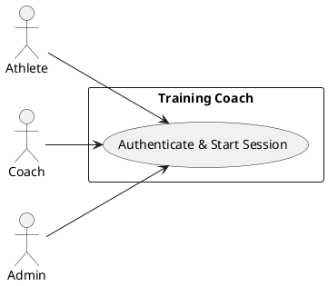
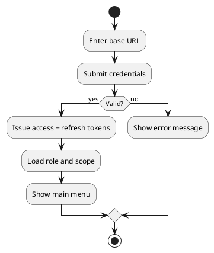
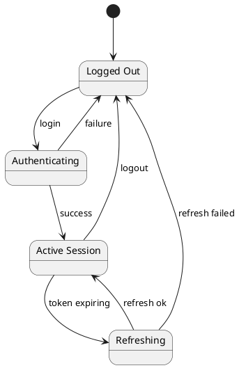

# UC0 Authenticate & Start Session

## Use Case Diagram

```plantuml
@startuml
left to right direction
actor Athlete
actor Coach
actor Admin
rectangle "Training Coach" {
  usecase "Authenticate & Start Session" as UC0
}
Athlete --> UC0
Coach --> UC0
Admin --> UC0
@enduml
```

## Activity Diagram

```plantuml
@startuml
start
:Enter base URL;
:Submit credentials;
if (Valid?) then (yes)
  :Issue access + refresh tokens;
  :Load role and scope;
  :Show main menu;
else (no)
  :Show error message;
endif
stop
@enduml
```

## Workflow State Diagram

```plantuml
@startuml
state "Logged Out" as LoggedOut
state "Authenticating" as Authenticating
state "Active Session" as Active
state "Refreshing" as Refreshing

[*] --> LoggedOut
LoggedOut --> Authenticating : login
Authenticating --> Active : success
Authenticating --> LoggedOut : failure
Active --> Refreshing : token expiring
Refreshing --> Active : refresh ok
Refreshing --> LoggedOut : refresh failed
Active --> LoggedOut : logout
@enduml
```
