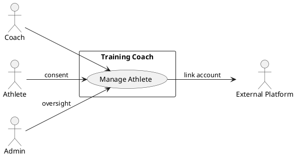
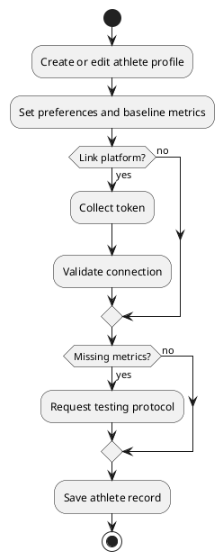
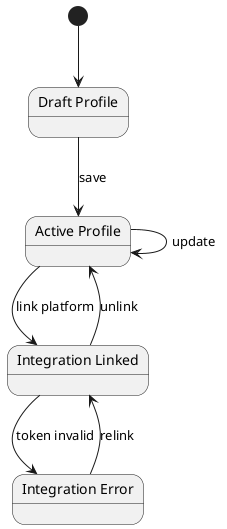

# UC1 Manage Athlete

## Use Case Diagram

```plantuml
@startuml
left to right direction
actor Coach
actor Athlete
actor Admin
actor "External Platform" as Platform
rectangle "Training Coach" {
  usecase "Manage Athlete" as UC1
}
Coach --> UC1
Athlete --> UC1 : consent
Admin --> UC1 : oversight
UC1 --> Platform : link account
@enduml
```

## Activity Diagram

```plantuml
@startuml
start
:Create or edit athlete profile;
:Set preferences and baseline metrics;
if (Link platform?) then (yes)
  :Collect token;
  :Validate connection;
else (no)
endif
if (Missing metrics?) then (yes)
  :Request testing protocol;
else (no)
endif
:Save athlete record;
stop
@enduml
```

## Workflow State Diagram

```plantuml
@startuml
state "Draft Profile" as Draft
state "Active Profile" as Active
state "Integration Linked" as Linked
state "Integration Error" as Error

[*] --> Draft
Draft --> Active : save
Active --> Active : update
Active --> Linked : link platform
Linked --> Active : unlink
Linked --> Error : token invalid
Error --> Linked : relink
@enduml
```
