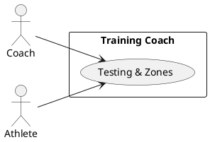
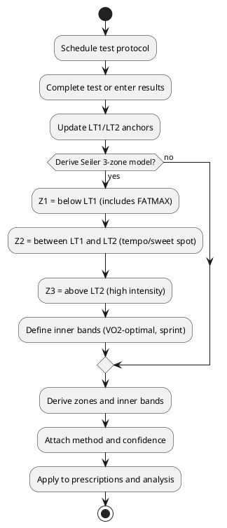
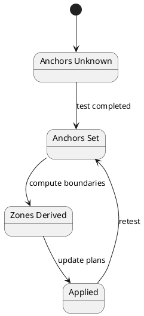

# UC10 Testing & Zones

## Use Case Diagram

```plantuml
@startuml
left to right direction
actor Coach
actor Athlete
rectangle "Training Coach" {
  usecase "Testing & Zones" as UC10
}
Coach --> UC10
Athlete --> UC10
@enduml
```

## Activity Diagram

```plantuml
@startuml
start
:Schedule test protocol;
:Complete test or enter results;
:Update LT1/LT2 anchors;
if (Derive Seiler 3-zone model?) then (yes)
  :Z1 = below LT1 (includes FATMAX);
  :Z2 = between LT1 and LT2 (tempo/sweet spot);
  :Z3 = above LT2 (high intensity);
  :Define inner bands (VO2-optimal, sprint);
else (no)
endif
:Derive zones and inner bands;
:Attach method and confidence;
:Apply to prescriptions and analysis;
stop
@enduml
```

## Workflow State Diagram

```plantuml
@startuml
state "Anchors Unknown" as Unknown
state "Anchors Set" as Set
state "Zones Derived" as Zones
state "Applied" as Applied

[*] --> Unknown
Unknown --> Set : test completed
Set --> Zones : compute boundaries
Zones --> Applied : update plans
Applied --> Set : retest
@enduml
```
