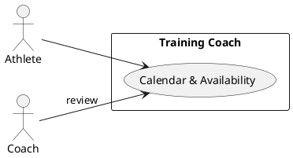
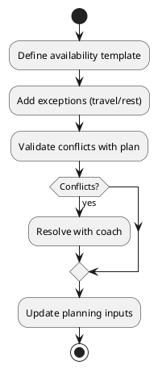
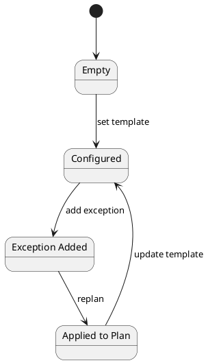

# UC11 Calendar & Availability

## Use Case Diagram

```plantuml
@startuml
left to right direction
actor Athlete
actor Coach
rectangle "Training Coach" {
  usecase "Calendar & Availability" as UC11
}
Athlete --> UC11
Coach --> UC11 : review
@enduml
```

## Activity Diagram

```plantuml
@startuml
start
:Define availability template;
:Add exceptions (travel/rest);
:Validate conflicts with plan;
if (Conflicts?) then (yes)
  :Resolve with coach;
endif
:Update planning inputs;
stop
@enduml
```

## Workflow State Diagram

```plantuml
@startuml
state "Empty" as Empty
state "Configured" as Configured
state "Exception Added" as Exception
state "Applied to Plan" as Applied

[*] --> Empty
Empty --> Configured : set template
Configured --> Exception : add exception
Exception --> Applied : replan
Applied --> Configured : update template
@enduml
```
