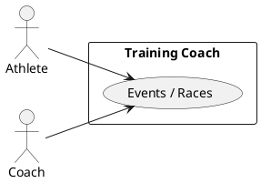
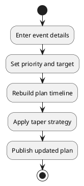
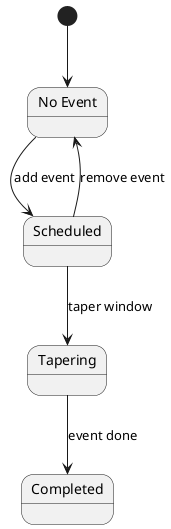

# UC12 Events / Races

## Use Case Diagram

```plantuml
@startuml
left to right direction
actor Athlete
actor Coach
rectangle "Training Coach" {
  usecase "Events / Races" as UC12
}
Athlete --> UC12
Coach --> UC12
@enduml
```

## Activity Diagram

```plantuml
@startuml
start
:Enter event details;
:Set priority and target;
:Rebuild plan timeline;
:Apply taper strategy;
:Publish updated plan;
stop
@enduml
```

## Workflow State Diagram

```plantuml
@startuml
state "No Event" as None
state "Scheduled" as Scheduled
state "Tapering" as Tapering
state "Completed" as Completed

[*] --> None
None --> Scheduled : add event
Scheduled --> Tapering : taper window
Tapering --> Completed : event done
Scheduled --> None : remove event
@enduml
```
