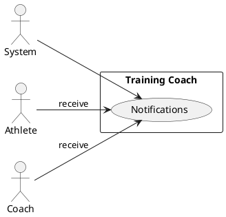
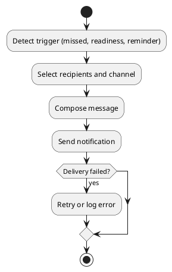
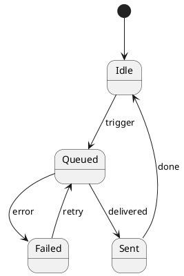

# UC13 Notifications

## Use Case Diagram

```plantuml
@startuml
left to right direction
actor System
actor Athlete
actor Coach
rectangle "Training Coach" {
  usecase "Notifications" as UC13
}
System --> UC13
Athlete --> UC13 : receive
Coach --> UC13 : receive
@enduml
```

## Activity Diagram

```plantuml
@startuml
start
:Detect trigger (missed, readiness, reminder);
:Select recipients and channel;
:Compose message;
:Send notification;
if (Delivery failed?) then (yes)
  :Retry or log error;
endif
stop
@enduml
```

## Workflow State Diagram

```plantuml
@startuml
state "Idle" as Idle
state "Queued" as Queued
state "Sent" as Sent
state "Failed" as Failed

[*] --> Idle
Idle --> Queued : trigger
Queued --> Sent : delivered
Queued --> Failed : error
Failed --> Queued : retry
Sent --> Idle : done
@enduml
```
