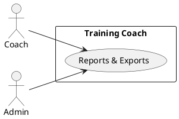
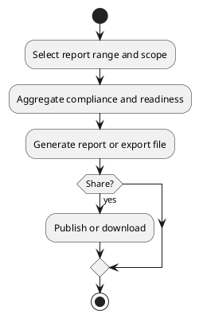
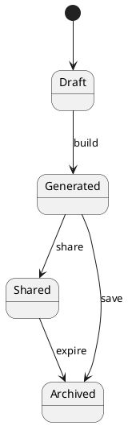

# UC14 Reports & Exports

## Use Case Diagram

```plantuml
@startuml
left to right direction
actor Coach
actor Admin
rectangle "Training Coach" {
  usecase "Reports & Exports" as UC14
}
Coach --> UC14
Admin --> UC14
@enduml
```

## Activity Diagram

```plantuml
@startuml
start
:Select report range and scope;
:Aggregate compliance and readiness;
:Generate report or export file;
if (Share?) then (yes)
  :Publish or download;
endif
stop
@enduml
```

## Workflow State Diagram

```plantuml
@startuml
state "Draft" as Draft
state "Generated" as Generated
state "Shared" as Shared
state "Archived" as Archived

[*] --> Draft
Draft --> Generated : build
Generated --> Shared : share
Generated --> Archived : save
Shared --> Archived : expire
@enduml
```
