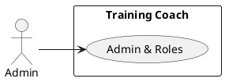
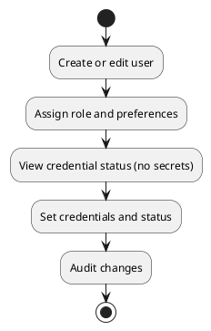
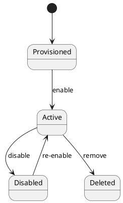

# UC15 Admin & Roles

## Use Case Diagram

```plantuml
@startuml
left to right direction
actor Admin
rectangle "Training Coach" {
  usecase "Admin & Roles" as UC15
}
Admin --> UC15
@enduml
```

## Activity Diagram

```plantuml
@startuml
start
:Create or edit user;
:Assign role and preferences;
:View credential status (no secrets);
:Set credentials and status;
:Audit changes;
stop
@enduml
```

## Workflow State Diagram

```plantuml
@startuml
state "Provisioned" as Provisioned
state "Active" as Active
state "Disabled" as Disabled
state "Deleted" as Deleted

[*] --> Provisioned
Provisioned --> Active : enable
Active --> Disabled : disable
Disabled --> Active : re-enable
Active --> Deleted : remove
@enduml
```
