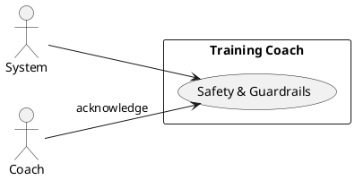
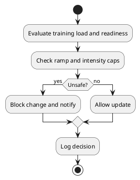
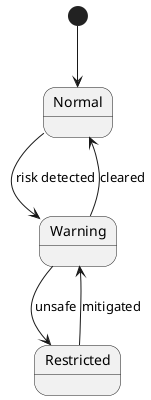

# UC16 Safety & Guardrails

## Use Case Diagram

```plantuml
@startuml
left to right direction
actor System
actor Coach
rectangle "Training Coach" {
  usecase "Safety & Guardrails" as UC16
}
System --> UC16
Coach --> UC16 : acknowledge
@enduml
```

## Activity Diagram

```plantuml
@startuml
start
:Evaluate training load and readiness;
:Check ramp and intensity caps;
if (Unsafe?) then (yes)
  :Block change and notify;
else (no)
  :Allow update;
endif
:Log decision;
stop
@enduml
```

## Workflow State Diagram

```plantuml
@startuml
state "Normal" as Normal
state "Warning" as Warning
state "Restricted" as Restricted

[*] --> Normal
Normal --> Warning : risk detected
Warning --> Restricted : unsafe
Restricted --> Warning : mitigated
Warning --> Normal : cleared
@enduml
```
