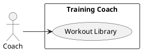
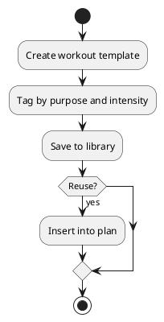
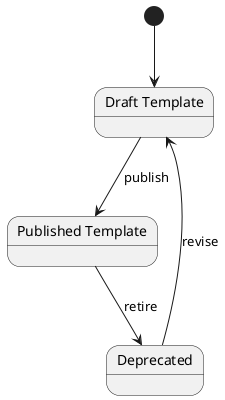

# UC17 Workout Library

## Use Case Diagram

```plantuml
@startuml
left to right direction
actor Coach
rectangle "Training Coach" {
  usecase "Workout Library" as UC17
}
Coach --> UC17
@enduml
```

## Activity Diagram

```plantuml
@startuml
start
:Create workout template;
:Tag by purpose and intensity;
:Save to library;
if (Reuse?) then (yes)
  :Insert into plan;
endif
stop
@enduml
```

## Workflow State Diagram

```plantuml
@startuml
state "Draft Template" as Draft
state "Published Template" as Published
state "Deprecated" as Deprecated

[*] --> Draft
Draft --> Published : publish
Published --> Deprecated : retire
Deprecated --> Draft : revise
@enduml
```
