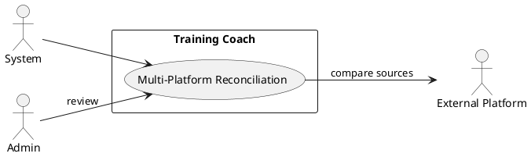
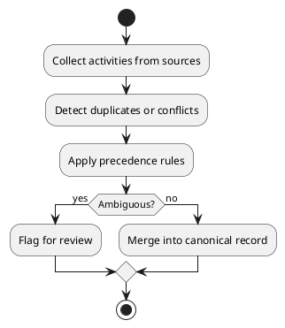
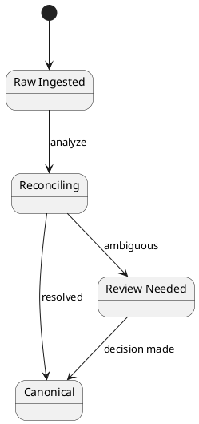

# UC18 Multi-Platform Reconciliation

## Use Case Diagram

```plantuml
@startuml
left to right direction
actor System
actor Admin
actor "External Platform" as Platform
rectangle "Training Coach" {
  usecase "Multi-Platform Reconciliation" as UC18
}
System --> UC18
Admin --> UC18 : review
UC18 --> Platform : compare sources
@enduml
```

## Activity Diagram

```plantuml
@startuml
start
:Collect activities from sources;
:Detect duplicates or conflicts;
:Apply precedence rules;
if (Ambiguous?) then (yes)
  :Flag for review;
else (no)
  :Merge into canonical record;
endif
stop
@enduml
```

## Workflow State Diagram

```plantuml
@startuml
state "Raw Ingested" as Raw
state "Reconciling" as Reconciling
state "Canonical" as Canonical
state "Review Needed" as Review

[*] --> Raw
Raw --> Reconciling : analyze
Reconciling --> Canonical : resolved
Reconciling --> Review : ambiguous
Review --> Canonical : decision made
@enduml
```
