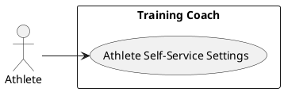
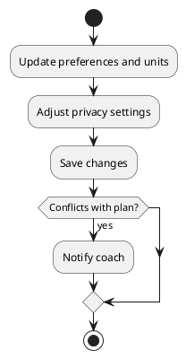
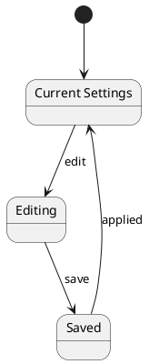

# UC19 Athlete Self-Service Settings

## Use Case Diagram

```plantuml
@startuml
left to right direction
actor Athlete
rectangle "Training Coach" {
  usecase "Athlete Self-Service Settings" as UC19
}
Athlete --> UC19
@enduml
```

## Activity Diagram

```plantuml
@startuml
start
:Update preferences and units;
:Adjust privacy settings;
:Save changes;
if (Conflicts with plan?) then (yes)
  :Notify coach;
endif
stop
@enduml
```

## Workflow State Diagram

```plantuml
@startuml
state "Current Settings" as Current
state "Editing" as Editing
state "Saved" as Saved

[*] --> Current
Current --> Editing : edit
Editing --> Saved : save
Saved --> Current : applied
@enduml
```
