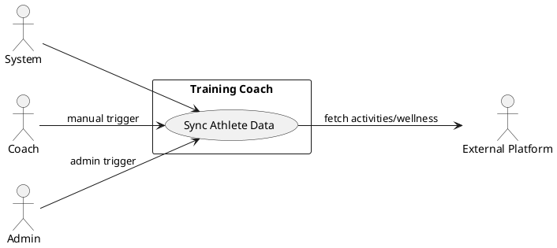
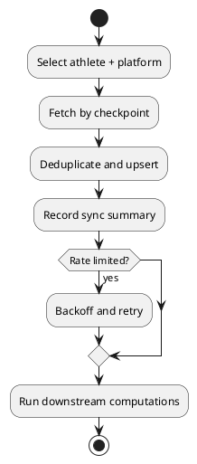
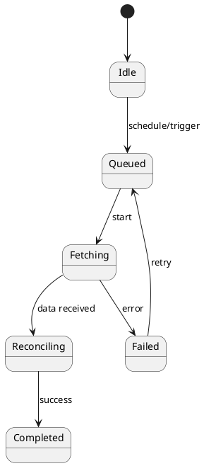

# UC2 Sync Athlete Data

## Use Case Diagram

```plantuml
@startuml
left to right direction
actor System
actor Coach
actor Admin
actor "External Platform" as Platform
rectangle "Training Coach" {
  usecase "Sync Athlete Data" as UC2
}
System --> UC2
Coach --> UC2 : manual trigger
Admin --> UC2 : admin trigger
UC2 --> Platform : fetch activities/wellness
@enduml
```

## Activity Diagram

```plantuml
@startuml
start
:Select athlete + platform;
:Fetch by checkpoint;
:Deduplicate and upsert;
:Record sync summary;
if (Rate limited?) then (yes)
  :Backoff and retry;
endif
:Run downstream computations;
stop
@enduml
```

## Workflow State Diagram

```plantuml
@startuml
state "Idle" as Idle
state "Queued" as Queued
state "Fetching" as Fetching
state "Reconciling" as Reconciling
state "Completed" as Completed
state "Failed" as Failed

[*] --> Idle
Idle --> Queued : schedule/trigger
Queued --> Fetching : start
Fetching --> Reconciling : data received
Reconciling --> Completed : success
Fetching --> Failed : error
Failed --> Queued : retry
@enduml
```
