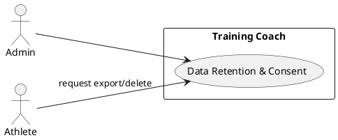
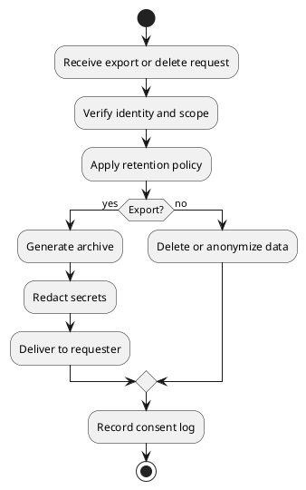
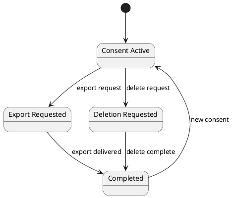

# UC20 Data Retention & Consent

## Use Case Diagram

```plantuml
@startuml
left to right direction
actor Admin
actor Athlete
rectangle "Training Coach" {
  usecase "Data Retention & Consent" as UC20
}
Admin --> UC20
Athlete --> UC20 : request export/delete
@enduml
```

## Activity Diagram

```plantuml
@startuml
start
:Receive export or delete request;
:Verify identity and scope;
:Apply retention policy;
if (Export?) then (yes)
  :Generate archive;
  :Redact secrets;
  :Deliver to requester;
else (no)
  :Delete or anonymize data;
endif
:Record consent log;
stop
@enduml
```

## Workflow State Diagram

```plantuml
@startuml
state "Consent Active" as Active
state "Export Requested" as ExportRequested
state "Deletion Requested" as DeleteRequested
state "Completed" as Completed

[*] --> Active
Active --> ExportRequested : export request
Active --> DeleteRequested : delete request
ExportRequested --> Completed : export delivered
DeleteRequested --> Completed : delete complete
Completed --> Active : new consent
@enduml
```
