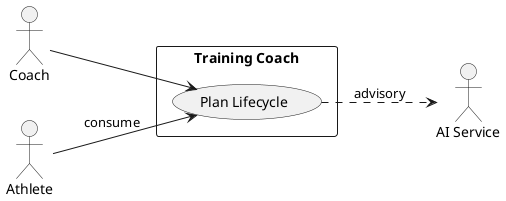
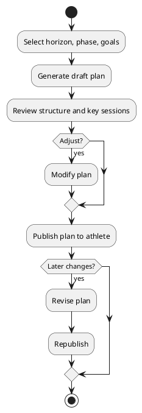
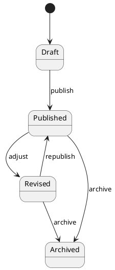

# UC3 Plan Lifecycle

## Use Case Diagram

```plantuml
@startuml
left to right direction
actor Coach
actor Athlete
actor "AI Service" as AI
rectangle "Training Coach" {
  usecase "Plan Lifecycle" as UC3
}
Coach --> UC3
Athlete --> UC3 : consume
UC3 ..> AI : advisory
@enduml
```

## Activity Diagram

```plantuml
@startuml
start
:Select horizon, phase, goals;
:Generate draft plan;
:Review structure and key sessions;
if (Adjust?) then (yes)
  :Modify plan;
endif
:Publish plan to athlete;
if (Later changes?) then (yes)
  :Revise plan;
  :Republish;
endif
stop
@enduml
```

## Workflow State Diagram

```plantuml
@startuml
state "Draft" as Draft
state "Published" as Published
state "Revised" as Revised
state "Archived" as Archived

[*] --> Draft
Draft --> Published : publish
Published --> Revised : adjust
Revised --> Published : republish
Published --> Archived : archive
Revised --> Archived : archive
@enduml
```
