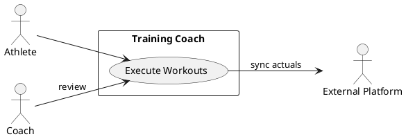
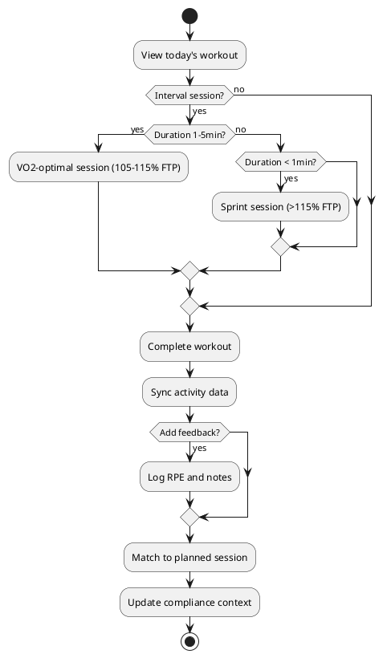
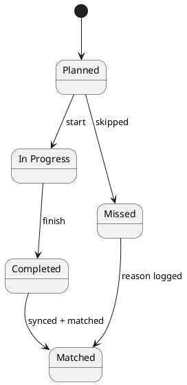

# UC4 Execute Workouts

## Use Case Diagram

```plantuml
@startuml
left to right direction
actor Athlete
actor Coach
actor "External Platform" as Platform
rectangle "Training Coach" {
  usecase "Execute Workouts" as UC4
}
Athlete --> UC4
Coach --> UC4 : review
UC4 --> Platform : sync actuals
@enduml
```

## Activity Diagram

```plantuml
@startuml
start
:View today's workout;
if (Interval session?) then (yes)
  if (Duration 1-5min?) then (yes)
    :VO2-optimal session (105-115% FTP);
  else (no)
    if (Duration < 1min?) then (yes)
      :Sprint session (>115% FTP);
    endif
  endif
else (no)
endif
:Complete workout;
:Sync activity data;
if (Add feedback?) then (yes)
  :Log RPE and notes;
endif
:Match to planned session;
:Update compliance context;
stop
@enduml
```

## Workflow State Diagram

```plantuml
@startuml
state "Planned" as Planned
state "In Progress" as InProgress
state "Completed" as Completed
state "Missed" as Missed
state "Matched" as Matched

[*] --> Planned
Planned --> InProgress : start
InProgress --> Completed : finish
Planned --> Missed : skipped
Completed --> Matched : synced + matched
Missed --> Matched : reason logged
@enduml
```
