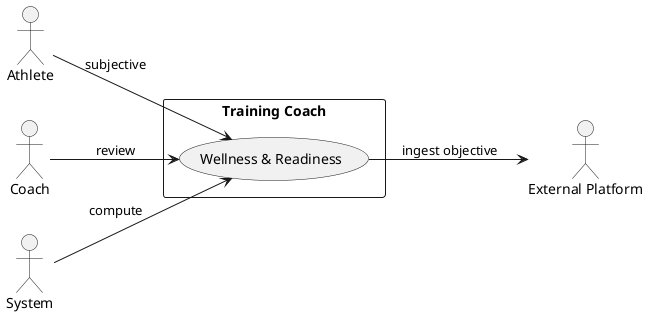
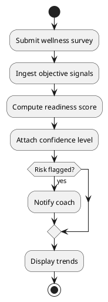
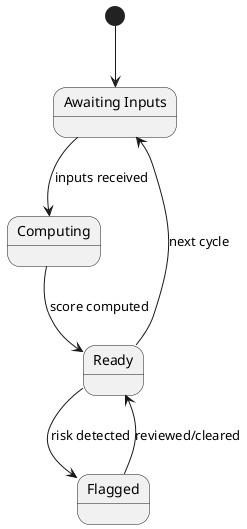

# UC5 Wellness & Readiness

## Use Case Diagram

```plantuml
@startuml
left to right direction
actor Athlete
actor Coach
actor System
actor "External Platform" as Platform
rectangle "Training Coach" {
  usecase "Wellness & Readiness" as UC5
}
Athlete --> UC5 : subjective
Coach --> UC5 : review
System --> UC5 : compute
UC5 --> Platform : ingest objective
@enduml
```

## Activity Diagram

```plantuml
@startuml
start
:Submit wellness survey;
:Ingest objective signals;
:Compute readiness score;
:Attach confidence level;
if (Risk flagged?) then (yes)
  :Notify coach;
endif
:Display trends;
stop
@enduml
```

## Workflow State Diagram

```plantuml
@startuml
state "Awaiting Inputs" as Awaiting
state "Computing" as Computing
state "Ready" as Ready
state "Flagged" as Flagged

[*] --> Awaiting
Awaiting --> Computing : inputs received
Computing --> Ready : score computed
Ready --> Flagged : risk detected
Flagged --> Ready : reviewed/cleared
Ready --> Awaiting : next cycle
@enduml
```
