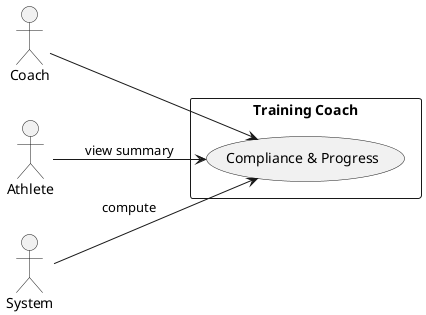
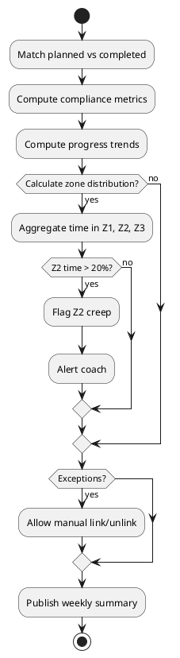
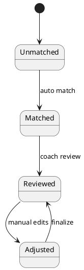

# UC6 Compliance & Progress

## Use Case Diagram

```plantuml
@startuml
left to right direction
actor Coach
actor Athlete
actor System
rectangle "Training Coach" {
  usecase "Compliance & Progress" as UC6
}
Coach --> UC6
Athlete --> UC6 : view summary
System --> UC6 : compute
@enduml
```

## Activity Diagram

```plantuml
@startuml
start
:Match planned vs completed;
:Compute compliance metrics;
:Compute progress trends;
if (Calculate zone distribution?) then (yes)
  :Aggregate time in Z1, Z2, Z3;
  if (Z2 time > 20%?) then (yes)
    :Flag Z2 creep;
    :Alert coach;
  else (no)
  endif
else (no)
endif
if (Exceptions?) then (yes)
  :Allow manual link/unlink;
endif
:Publish weekly summary;
stop
@enduml
```

## Workflow State Diagram

```plantuml
@startuml
state "Unmatched" as Unmatched
state "Matched" as Matched
state "Reviewed" as Reviewed
state "Adjusted" as Adjusted

[*] --> Unmatched
Unmatched --> Matched : auto match
Matched --> Reviewed : coach review
Reviewed --> Adjusted : manual edits
Adjusted --> Reviewed : finalize
@enduml
```
