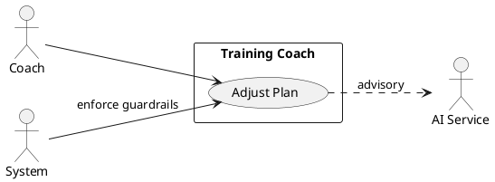
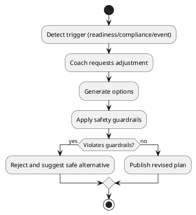
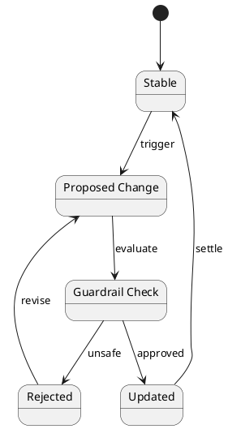

# UC7 Adjust Plan

## Use Case Diagram

```plantuml
@startuml
left to right direction
actor Coach
actor System
actor "AI Service" as AI
rectangle "Training Coach" {
  usecase "Adjust Plan" as UC7
}
Coach --> UC7
System --> UC7 : enforce guardrails
UC7 ..> AI : advisory
@enduml
```

## Activity Diagram

```plantuml
@startuml
start
:Detect trigger (readiness/compliance/event);
:Coach requests adjustment;
:Generate options;
:Apply safety guardrails;
if (Violates guardrails?) then (yes)
  :Reject and suggest safe alternative;
else (no)
  :Publish revised plan;
endif
stop
@enduml
```

## Workflow State Diagram

```plantuml
@startuml
state "Stable" as Stable
state "Proposed Change" as Proposed
state "Guardrail Check" as Guardrail
state "Updated" as Updated
state "Rejected" as Rejected

[*] --> Stable
Stable --> Proposed : trigger
Proposed --> Guardrail : evaluate
Guardrail --> Updated : approved
Guardrail --> Rejected : unsafe
Rejected --> Proposed : revise
Updated --> Stable : settle
@enduml
```
