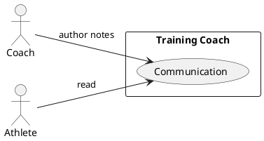
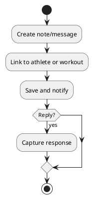
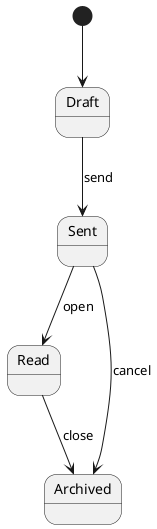

# UC8 Communication

## Use Case Diagram

```plantuml
@startuml
left to right direction
actor Coach
actor Athlete
rectangle "Training Coach" {
  usecase "Communication" as UC8
}
Coach --> UC8 : author notes
Athlete --> UC8 : read
@enduml
```

## Activity Diagram

```plantuml
@startuml
start
:Create note/message;
:Link to athlete or workout;
:Save and notify;
if (Reply?) then (yes)
  :Capture response;
endif
stop
@enduml
```

## Workflow State Diagram

```plantuml
@startuml
state "Draft" as Draft
state "Sent" as Sent
state "Read" as Read
state "Archived" as Archived

[*] --> Draft
Draft --> Sent : send
Sent --> Read : open
Read --> Archived : close
Sent --> Archived : cancel
@enduml
```
