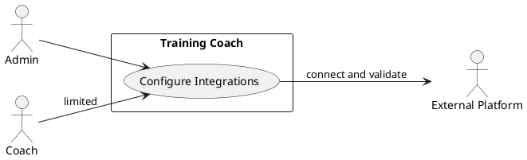
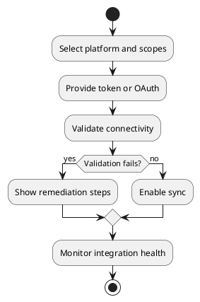
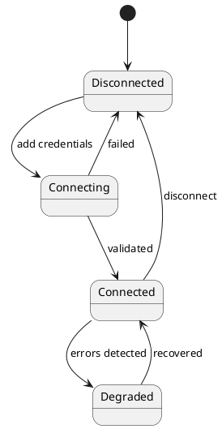

# UC9 Configure Integrations

## Use Case Diagram

```plantuml
@startuml
left to right direction
actor Admin
actor Coach
actor "External Platform" as Platform
rectangle "Training Coach" {
  usecase "Configure Integrations" as UC9
}
Admin --> UC9
Coach --> UC9 : limited
UC9 --> Platform : connect and validate
@enduml
```

## Activity Diagram

```plantuml
@startuml
start
:Select platform and scopes;
:Provide token or OAuth;
:Validate connectivity;
if (Validation fails?) then (yes)
  :Show remediation steps;
else (no)
  :Enable sync;
endif
:Monitor integration health;
stop
@enduml
```

## Workflow State Diagram

```plantuml
@startuml
state "Disconnected" as Disconnected
state "Connecting" as Connecting
state "Connected" as Connected
state "Degraded" as Degraded

[*] --> Disconnected
Disconnected --> Connecting : add credentials
Connecting --> Connected : validated
Connecting --> Disconnected : failed
Connected --> Degraded : errors detected
Degraded --> Connected : recovered
Connected --> Disconnected : disconnect
@enduml
```
